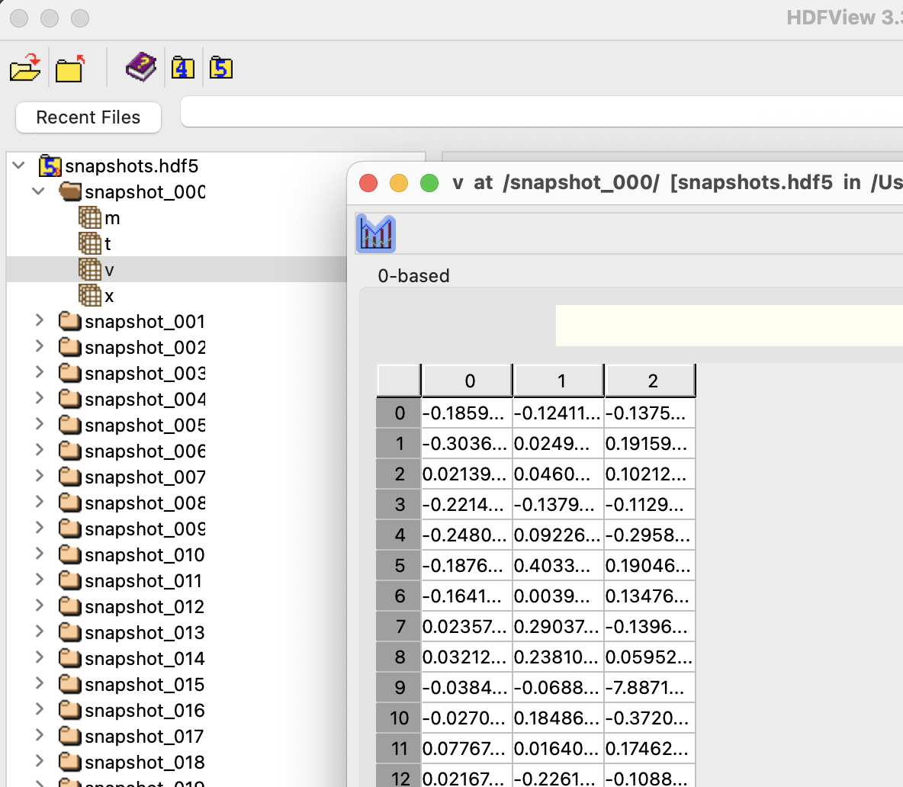

# N-body simulation with HDF5 Storage

## Overview
This project provides a C++ implementation for storing simulation snapshots in HDF5 format. The `Makefile` is designed to automatically detect whether the environment is Linux or macOS and compile the project accordingly. The generated HDF5 file organizes snapshots hierarchically for structured data management.

## What is HDF5?


HDF5 (Hierarchical Data Format version 5) is a data model, library, and file format for storing and managing large amounts of scientific and engineering data. It allows for hierarchical organization, metadata storage, and high-performance I/O operations, making it ideal for numerical simulations and large-scale data processing.

## Installation
### Dependencies
Ensure that HDF5 and a C++17-compatible compiler (such as `g++`) are installed.

For **Linux (Ubuntu/Debian)**:
```sh
sudo apt install libhdf5-dev g++
```
For **macOS (Homebrew)**:
```sh
brew install hdf5
```
For **Windows (vcpkg)**:
```sh
vcpkg install hdf5
```

If you need the latest version of HDF5 or do not have admin (sudo) privileges, you can install the HDF5 package from the following link: [HDF5 Official Downloads](https://www.hdfgroup.org/download-hdf5/source-code/)

## Compiling

To compile the project, simply run:
```sh
make
```

### Updating Include Paths
Since `H5Cpp.h` may be located in different directories depending on your system, you may need to manually update the `Makefile` with the correct include path. To find its location, run:
```sh
locate H5Cpp.h
```
Then, modify the `INCLUDES` path in the `Makefile` accordingly.

## Running the Simulation
After compiling, execute the program with:
```sh
./collapse_hdf5
```
This will generate an HDF5 file containing structured snapshot data.

## Parameter File: `param.txt`
The parameters for the simulation are stored in `param.txt`. The order of the parameters **must not be changed**, as future updates will enhance the ability to handle configuration files dynamically.

## HDF5 File Structure
The output HDF5 file is structured as follows:
```
snapshots.hdf5
├── snapshot_001
│   ├── t  (double)    # Time
│   ├── x  (double[n][3])  # Position array
│   ├── v  (double[n][3])  # Velocity array
│   ├── m  (double[n])  # Mass array
├── snapshot_002
│   ├── t  (double)
│   ├── x  (double[n][3])
│   ├── v  (double[n][3])
│   ├── m  (double[n])
├── snapshot_003
│   ├── t  (double)
│   ├── x  (double[n][3])
│   ├── v  (double[n][3])
│   ├── m  (double[n])
```
Each snapshot contains:
- **t**: The time step of the snapshot.
- **x**: The positions of all particles in 3D.
- **v**: The velocities of all particles in 3D.
- **m**: The mass of each particle.



By default, the program is set to generate an output similar to:


## Author
Daisuke NISHIHAMA (ddd3h)